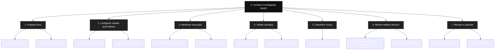
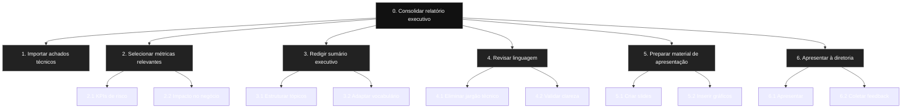

# Projeto de IHC – Automação da Geração de Relatórios Baseados em OSINT

## Membros da Equipe
- Guilherme de Abreu – 22.222.028-7  
- Kaique Fernandes – 22.221.011-4  

---

##    Entrega 1 – Conhecendo o Problema  (28-08-2025) [Concluído]

### 1.1) Membros da Equipe  
- Guilherme de Abreu – 22.222.028-7  
- Kaique Fernandes – 22.221.011-4  

### 1.2) Título Original do TCC  
Automação da Geração de Relatórios Baseados em OSINT  

### 1.3) Nome do Orientador  
** Prof. Dr. Leonardo Anjoletto Ferreira 

### 1.4) Previsto desenvolver Interface?  
(X) Sim  

### 1.5) Objetivo do trabalho  
Desenvolver uma ferramenta que automatize a coleta e análise de informações públicas (OSINT) para gerar relatórios de pentest de forma ágil, padronizada e confiável.  

### 1.6) Produto final  
Uma aplicação com interface web que realiza buscas OSINT (ex.: HaveIBeenPwned, Shodan, Google Dorks), organiza os dados e gera relatórios automatizados em PDF.  

### 1.7) Usuário final  
Pentesters, analistas de segurança da informação e empresas que desejam validar exposição de dados sensíveis.  

### 1.8) Benefício ao usuário  
- Redução do tempo de coleta manual  
- Relatórios padronizados  
- Maior precisão nas análises  
- Suporte a auditorias de conformidade (LGPD, ISO 27001, etc.)  

### 1.9) Funcionalidades (visão do usuário)  
- Inserir alvo (domínio/email/IP)  
- Executar busca OSINT  
- Visualizar resultados organizados  
- Gerar relatório automático  
- Exportar relatório em PDF  

### 1.10) Tecnologias previstas  
- Linguagem: Typescript 
- Frameworks: Vite 
- Bibliotecas: ReportLab, React, Node
- APIs: Shodan, HaveIBeenPwned, TheHarvester  

### 1.11) Contexto de uso (conceito de IHC)  
Ambiente profissional de segurança cibernética, usado em computadores conectados à internet, por especialistas de TI. Contexto de **alta concentração e criticidade**, pois os resultados impactam auditorias de segurança e decisões empresariais.  

---

## Entrega 2 – Análise de Concorrência  (28-08-2025) [Concluído]

### Versão – Autor: Kaique Fernandes  

#### Público-alvo  
Pentesters independentes, analistas de segurança de pequenas/médias empresas, consultorias que buscam automatização.  

#### Concorrentes analisados  
- **TheHarvester** – coleta de e-mails e domínios a partir de motores de busca.  
- **Holehe** – checagem de e-mails em serviços populares.  

#### Características e funcionalidades  
- **TheHarvester:** busca de e-mails, subdomínios, hosts.  


- **Holehe:** verifica presença de e-mails em serviços (Netflix, Twitter, GitHub, etc.).  


#### Experiência do usuário (UX)  
- TheHarvester → simples, mas restrito a linha de comando.  
- Holehe → rápido, mas com saída técnica.  

#### Preços e modelos de negócio  
- TheHarvester: open source e gratuito.  
- Holehe: open source e gratuito.  

#### Padrões e tendências  
- Automação de consultas.  
- Exportação de relatórios automáticos.  
- Integração com APIs OSINT.  

---

### Versão – Autor: Guilherme de Abreu  

#### Público-alvo  
Empresas maiores, times internos de segurança e auditores que buscam otimizar auditorias.  

#### Concorrentes analisados  
- **PhoneInfoga** – coleta de informações sobre números de telefone. 

 
- **Maigret** – busca de perfis de usuários em centenas de sites.  


#### Características e funcionalidades  
- **PhoneInfoga:** metadados de números (país, operadora, possíveis registros).  
- **Maigret:** varredura massiva de nomes de usuário em redes sociais.  

#### Experiência do usuário (UX)  
- PhoneInfoga → simples, mas técnico.  
- Maigret → prático, mas saída longa e técnica.  

#### Preços e modelos de negócio  
- PhoneInfoga: open source e gratuito.  
- Maigret: open source e gratuito.  

#### Padrões e tendências  
- Integração com pipelines de segurança (CI/CD).  
- Uso de OSINT em larga escala para investigação de perfis digitais.  
- Democratização de ferramentas OSINT.  

---

## Entrega 3 – Personas, Mapa de Empatia, Contexto e Jornada (28-08-2025) [Concluído]

### Persona – Autor: Kaique Fernandes  
**Nome:** Lucas Andrade  
**Idade:** 27 anos  
**Profissão:** Analista de Pentest  
**Objetivos:** reduzir tempo de coleta manual e entregar relatórios rápidos e confiáveis.  
**Dores:** falta de padronização, retrabalho, pressão de prazos.  
**Expectativas:** interface simples, exportação rápida, relatórios profissionais.  


---

### Persona – Autor: Guilherme de Abreu  
**Nome:** Marina Souza  
**Idade:** 32 anos  
**Profissão:** Gerente de Segurança da Informação  
**Objetivos:** ter relatórios claros para apresentar.  
**Dores:** perda de tempo procurando dados manuais, dificuldade em consolidar informações.  
**Expectativas:** ferramenta confiável, relatórios com linguagem executiva, métricas visuais.  


---

### Mapa de Empatia (Equipe)  
- **Quem pensa/sente isso? (Marina)** → preocupação com qualidade e prazos de auditoria.  
- **Quem vê isso? (Lucas)** → múltiplas ferramentas fragmentadas.  
- **Quem ouve isso? (Marina)** → gestores pedindo clareza e rapidez.  
- **Quem fala/faz isso? (Lucas)** → usa scripts, consulta várias fontes.  
- **Quem sofre essas dores? (Equipe toda)** → retrabalho, risco de erro humano.  
- **Quem ganha com isso? (Equipe e gestores)** → economia de tempo, padronização, segurança da informação.  

---

### Contexto de Uso (Equipe)  
- **Local:** escritórios de segurança, consultorias, home office.  
- **Dispositivo:** computadores/notebooks.  
- **Ambiente:** multitarefa, conectado, de alta criticidade (impacta conformidade legal).  
- **Características sociais:**  
  - Trabalho colaborativo em equipe multidisciplinar.  
  - Relacionamento direto com gestores e clientes.  
  - Necessidade de comunicação clara e objetiva.  
  - Forte cobrança por produtividade e confiabilidade.  

---

### Jornada do Usuário  

#### Antes da ferramenta  
1. Usuário inicia projeto de pentest manualmente.  
2. Pesquisa dados em múltiplas fontes e scripts isolados.  
3. Gasta muito tempo consolidando informações.  
4. Sente frustração e pressão por prazos curtos.  
5. Relatórios finais ficam inconsistentes ou pouco visuais.  

**Sentimento antes:** sobrecarga, insegurança, falta de confiança no resultado.  

---

#### Depois da ferramenta  
1. Usuário inicia projeto e insere o alvo na aplicação.  
2. Sistema realiza buscas automáticas em APIs OSINT.  
3. Resultados organizados em dashboard centralizado.  
4. Geração de relatório padronizado em PDF.  
5. Cliente recebe documento final claro e objetivo.  

**Sentimento depois:** alívio, confiança na qualidade, satisfação por entregar dentro do prazo.  
**Resultado:** objetivos alcançados → relatórios rápidos, confiáveis e com linguagem adaptada ao público-alvo.  

---


## Entrega 4 – Cenário de Análise/Problema (08/09/2025) [Concluído]

---

### Cenário 1 – Autor: Kaique Fernandes

#### 1) Cenário de Análise/Problema  
Lucas, analista de pentest, está conduzindo um projeto para um cliente do setor financeiro.  
Ele precisa coletar dados de diversas fontes abertas para identificar possíveis vazamentos.  
O processo é todo manual: cada busca exige tempo, atenção e retrabalho, pois os dados chegam em formatos diferentes.  
O prazo do cliente é curto, e Lucas sente frustração porque, mesmo dedicando horas ao processo, o relatório final fica inconsistente e sujeito a erros.  

É uma rotina cansativa e repetitiva, que compromete a produtividade e aumenta a pressão sobre o analista.  

---

#### 2) Questões de Refinamento  
- Quais fontes de dados o analista costuma utilizar no processo manual?  
- Quanto tempo médio é gasto em cada projeto antes da entrega?  
- Que tipo de inconsistências mais aparecem nos relatórios finais?  
- De que forma a pressão do prazo impacta a qualidade do resultado?  
- Qual o sentimento principal do analista durante esse processo?  

---

#### 3) Refinamento do Cenário  
Lucas, como analista de pentest, precisa lidar diariamente com prazos curtos e uma grande quantidade de dados provenientes de diferentes fontes OSINT.  
Sem padronização, ele passa horas copiando, ajustando e organizando informações que chegam em formatos distintos.  
Esse esforço manual aumenta as chances de erro, gera retrabalho e resulta em relatórios pouco consistentes, o que o deixa constantemente estressado e inseguro sobre a qualidade do trabalho entregue.  

---

### Cenário 2 – Autor: Guilherme de Abreu

#### 1) Cenário de Análise/Problema  
Marina, gerente de segurança da informação, recebe relatórios de auditorias internas e externas de sua equipe.  
O problema é que cada documento chega em um formato diferente, com linguagem técnica e pouco acessível para os executivos.  
Ela precisa revisar, interpretar e consolidar manualmente as informações para criar uma versão clara que será apresentada em reuniões estratégicas.  
Esse processo consome muito tempo e gera insegurança sobre se a mensagem transmitida reflete de fato os riscos reais da organização.  

---

#### 2) Questões de Refinamento  
- Quais tipos de relatórios Marina costuma receber da equipe?  
- Quanto tempo ela gasta para consolidar as informações em uma versão executiva?  
- Quais as maiores dificuldades na comunicação entre parte técnica e executiva?  
- O que acontece quando a mensagem não é transmitida de forma clara para a diretoria?  
- Qual é o impacto emocional em Marina ao lidar com esse processo repetitivo?  

---

#### 3) Refinamento do Cenário  
Marina, gerente de segurança da informação, enfrenta constantemente a dificuldade de transformar relatórios técnicos em documentos estratégicos claros para a diretoria.  
O esforço de interpretar termos técnicos, reorganizar dados e montar métricas visuais demanda muito tempo e gera desgaste, especialmente quando há pressão de reuniões próximas.  
Ela sente insegurança ao consolidar os relatórios, pois teme que informações críticas sejam mal comunicadas ou que o nível executivo não compreenda o real impacto dos riscos apresentados.  

---


# Entrega 5 – Análise de Tarefas (15/09/2025) [Concluída]

---

## Persona 1 – Lucas Andrade (Analista de Pentest)

### 1) HTA – Hierarchical Task Analysis

**Funcionalidade analisada:** executar investigação OSINT de um alvo técnico e gerar relatório detalhado.  
Objetivo: reduzir esforço manual e consolidar resultados de múltiplas fontes.

#### Diagrama HTA

**Funcionalidade analisada:** executar buscas em diferentes APIs OSINT, validar resultados, remover falsos positivos e gerar um relatório técnico padronizado para o cliente.  
O HTA mostra que o processo segue uma sequência linear (preparar → coletar → validar → reportar), com possíveis iterações em casos de falha de coleta ou inconsistências.

#### 2) GOMS – Relatório OSINT Técnico

## Goal (G0)
**Produzir relatório OSINT técnico confiável.**

---

## Sub-goals
- **G1**: Preparar alvo e fontes  
- **G2**: Coletar dados  
- **G3**: Validar resultados  
- **G4**: Classificar riscos  
- **G5**: Montar relatório técnico  
- **G6**: Revisar e exportar  

---

## Operators (KLM)
- **K**: Keystroke (digitação)  
- **P**: Point (apontar/clicar)  
- **M**: Mental (decisão, reflexão, análise)  
- **Rᴿ**: Resposta do sistema  

---

## Método Exemplo – G2 (Coleta)
1. **Abrir módulo de coletas** (P)  
2. **Selecionar APIs** (P M)  
3. **Inserir alvo** (K M)  
4. **Iniciar varredura** (P)  
5. **Monitorar progresso** (Rᴿ M)  

---

## Selection Rules
- **Se prazo é curto** → priorizar fontes rápidas.  
- **Se coleta falha** → reexecutar fonte alternativa.  

---

## Explicação da Funcionalidade
O modelo **GOMS** detalha cada ação de Lucas, desde cliques até análises mentais.  
Ele evidencia:  
- Onde o tempo é gasto no processo.  
- Como decisões (selection rules) influenciam a fluidez da execução.  
- A relação entre interação humana e resposta do sistema para garantir eficiência.  


#CTT - ConcurTaskTrees
```ctt
Realizar_OSINT =
  Preparar_Alvo >> 
  (Configurar_Fontes ||| Disparar_Coleta) >> 
  Monitorar_Execucao >> 
  Validar_Achados >> 
  Classificar_Risco >> 
  Montar_Relatorio_Tecnico >> 
  Revisar_Exportar

Validar_Achados = Deduplicar >> Correlacionar >> Evidenciar
Montar_Relatorio_Tecnico = Template_Tecnico >> Inserir_Evidencias
```

**Explicação da funcionalidade: O CTT mostra a possibilidade de tarefas em paralelo (ex.: configurar fontes enquanto coleta roda). Esse modelo ajuda a otimizar multitarefa e prever gargalos no fluxo de Lucas.


## Persona 2 – Marina Souza (Gerente de Segurança)

#### 1) HTA – Hierarchical Task Analysis

**Funcionalidade analisada:** consolidar relatórios técnicos em versão executiva clara.  
**Objetivo:** traduzir achados técnicos em insights estratégicos.

#### Diagrama HTA


#### 2) GOMS – Relatório Executivo

#### Goal (G0)
**Produzir resumo executivo claro e convincente.**

---

#### Sub-goals
- **G1**: Importar achados  
- **G2**: Selecionar KPIs estratégicos  
- **G3**: Redigir sumário executivo  
- **G4**: Revisar linguagem  
- **G5**: Preparar material de apoio  
- **G6**: Apresentar à diretoria  

---

#### Operators (KLM)
- **K**: Keystroke (digitação)  
- **P**: Point (apontar/clicar)  
- **M**: Mental (decisão, reflexão, análise)  
- **S**: Preparar slides  

---

#### Método Exemplo – G3 (Redação)
1. **Listar tópicos de maior impacto** (M K)  
2. **Reescrever em linguagem executiva** (K M)  
3. **Inserir exemplos visuais** (P K)  

---

#### Selection Rules
- **Se audiência é executiva** → reduzir detalhes técnicos.  
- **Se reunião é estratégica** → destacar impacto financeiro.  

---

#### Explicação da funcionalidade
O modelo **GOMS** de Marina mostra a cadeia de ações **mentais e motoras** necessárias para transformar achados técnicos em **insights de negócio**.  
Ele destaca a importância das **decisões de comunicação**, que influenciam diretamente a clareza e a efetividade da mensagem ao público executivo.

### 3) CTT – ConcurTaskTrees

```ctt
Sintetizar_Relatorio_Executivo =
  Importar_Achados >> 
  Selecionar_KPIs >> 
  Redigir_Sumario_Exec >> 
  Revisar_Linguagem >> 
  Preparar_Apresentacao >> 
  Apresentar_Diretoria

Selecionar_KPIs = (Risco_Severidade ||| Nº_Incidentes ||| Tempo_Resposta)
Preparar_Apresentacao = Criar_Slides >> Inserir_Graficos
```

#### Explicação da funcionalidade 
O CTT mostra que Marina pode selecionar múltiplas métricas em paralelo antes de compor o sumário executivo.
Ele também evidencia a importância da revisão da linguagem, garantindo que a diretoria compreenda os riscos e indicadores sem jargão técnico, transformando relatórios técnicos em insights estratégicos.

_________________


## Entrega 6 - 22/09/2025 [Em andamento]

### Protótipo em Papel
(Inserir imagens/fotos dos protótipos desenhados à mão.)

---

## Entrega 7 - 29/09/2025 [Em andamento]

### 1) Identificação de Necessidades dos Usuários e Requisitos de IHC
- *Que dados coletar?*
- *De quem coletar?*

### 2) Aspectos Éticos
(Justificar com conceitos da disciplina — ex.: LGPD, privacidade, consentimento informado, etc.)

### 3) Ferramentas de Coleta de Dados  
#### 3.1) Nome do instrumento e objetivo  
#### 3.2) Como aplicar  
#### 3.3) Instrumento (link do formulário, roteiro de entrevista, etc.)

---

## Entrega 8 - 06/10/2025 [Em andamento]

### 1) Características da Plataforma
- *Descrição do Software:*  
- *Descrição do Hardware:*  
- *Lista de Capacidades da Plataforma (com explicação):*  
- *Lista de Restrições da Plataforma (com explicação):*

### 2) Princípios Gerais do Projeto
(Tabela com princípios + links + justificativa — ex.: LGPD, Acessibilidade, ISO 9241.)

### 3) Metas de Usabilidade
- *Qualitativas:*  
- *Quantitativas:*  
(Definir metas com justificativa e porcentagem.)

---

## Entrega 9 - 13/10/2025 [Em andamento]

### 1) Cenários de Interação
(Narrar como seria a interação na solução. Destacar diferenças em relação ao cenário problema.)

### 2) Design Centrado na Comunicação
(Representar falas e signos em formato de diálogo U/D.)

### 3) Mapa de Objetivos
(Colocar diagramas individuais e um consolidado.)

### 4) Esquema Conceitual de Signos
(Tabela com signos, origem, conteúdo, restrições, prevenção e recuperação.)

---

## Entrega 10 - 20/10/2025 [Em andamento]

### MOLIC
- *Nome do Cenário:*  
- *Diagrama:*  

---

## Entrega 11 - 27/10/2025 [Em andamento]

### Protótipo Correspondente ao MOLIC
- *Link para o Figma:*  

---

## Entrega 12 - 03/11/2025 [Em andamento]

### a) Planejamento de Usabilidade (Método DECIDE)
- *D:*  
- *E:*  
- *C:*  
- *I:*  
- *D:*  
- *E:*  

### b) Lista de Instrumentos
- Termo de consentimento  
- Questionários  
- Tabela de Observação  
- Formulário de avaliação heurística  

---

## Entrega 13 - 10/11/2025 [Em andamento]

### A) Avaliação de IHC através de inspeção HEURÍSTICA
(Para cada tela, listar violações de heurísticas de Nielsen com severidade 0 a 4.)

### B) Indicação de Boas Práticas de Heurística
(Um exemplo do sistema onde a heurística foi atendida.)

---

## Entrega 14 - 17/11/2025 [Em andamento]

### A) Fluxograma de Avaliação de Usabilidade por Observação do Usuário
(Fluxo de como o teste será aplicado.)

### B) Descrição do Procedimento de Preparação do Teste
- Passo 1: ...  
- Passo 2: Lista de tarefas  
- Passo 3: Formulário de perfil do usuário  
- etc.  

### C) Resultados do Teste
Tabela:  
- Grau de sucesso  
- Erros cometidos  
- Tipos de erros  
- Tempo necessário  
- Grau de satisfação  

- *Links dos vídeos:*  
- *Respostas dos formulários:*  
- *Conclusão da avaliação por observação do usuário:*  

---
